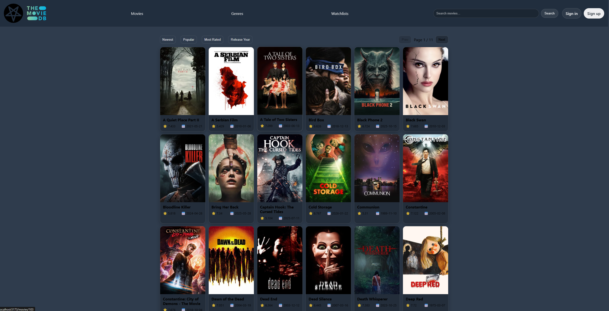
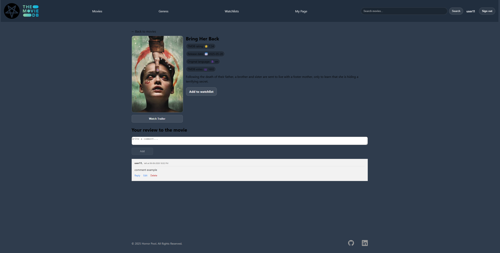
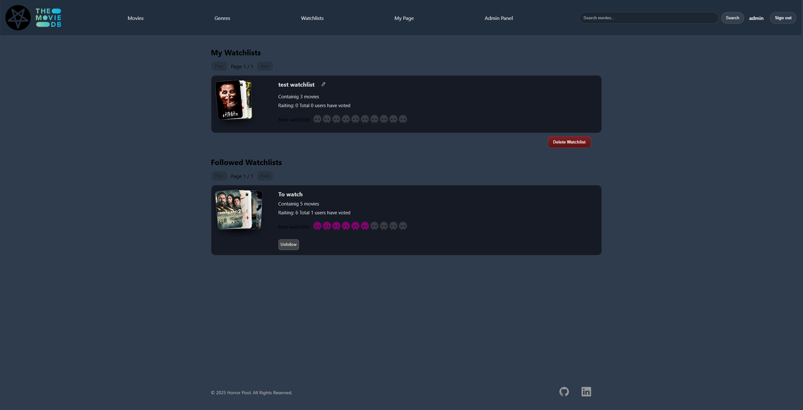
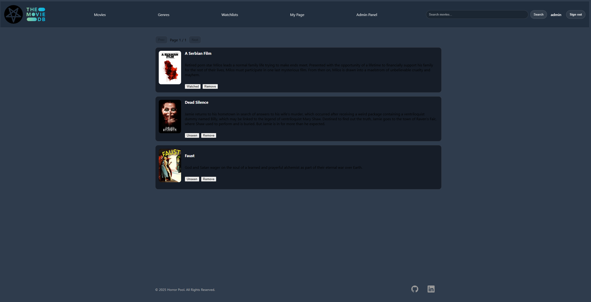
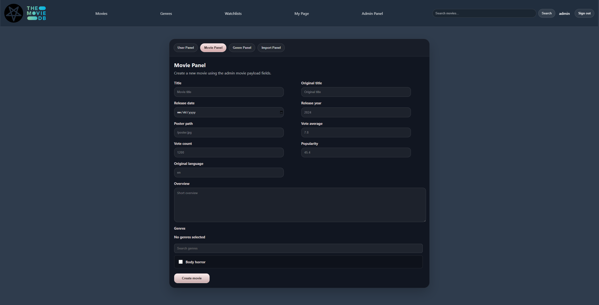

# Horror Pool

Spring Boot backend and React frontend for a horror movie catalog app. The app supports movie browsing, TMDB imports, JWT cookie authentication, roles, comments, user watchlists, public watchlists, filtering, and admin management.


---

## Highlights

- Full-stack horror movie catalog with React/Vite frontend and Spring Boot REST API
- JWT authentication stored in HTTP-only cookies with CSRF protection
- Role-based access for users and admins
- Movie search, filtering, sorting, pagination, comments, and replies
- User watchlists with watched toggles, public sharing, following, and rating
- Admin movie, genre, user, and TMDB import management
- PostgreSQL schema managed with Flyway migrations
- Docker Compose setup for local development and a production-like nginx stack
- CI checks for backend tests/package, frontend lint/build, and Docker smoke testing

---

## Screenshots

### Movie Catalog

Browse a paginated movie catalog with search, sorting, ratings, and release information.

[](docs/screenshots/movie_catalog.png)

### Movie Details and Comments

View movie metadata and trailers, add a movie to a watchlist, and participate in comment discussions.

[](docs/screenshots/movie_detail.png)

### Personal and Followed Watchlists

Create and manage personal watchlists, follow public lists, and rate lists shared by other users.

[](docs/screenshots/watchlist_general.png)

### Watchlist Details

Review the movies in a watchlist, update their watched status, or remove them from the list.

[](docs/screenshots/watchlist_detail.png)

### Admin Panel

Manage users, movies, genres, and TMDB imports through role-protected administration tools.

[](docs/screenshots/admin_panel.png)

---

## Tech Stack

- Java 21
- Spring Boot 3
- Spring Security + JWT
- PostgreSQL
- Flyway
- Maven
- JPA/Hibernate
- ModelMapper
- React + Vite
- Docker Compose
- resilience4j

---

## Data Source & Attribution

<p>
  <a href="https://www.themoviedb.org/">
    
  </a>
</p>

This product uses the TMDB API but is not endorsed or certified by TMDB.

---

## Getting Started

### Option 1: Backend and Database with Docker, Frontend with Vite

Prerequisites:

- Docker Desktop or Docker Engine with Compose v2
- JDK 21 and the Maven wrapper
- Node.js 22+ for the frontend dev server

1. Clone the repository:

```bash
git clone https://github.com/IlyaIbragimov/horror_pool.git
cd horror_pool
```

2. Create `.env` from the example:

```bash
cp .env.example .env
```

3. Edit `.env` and set the required values:

```env
POSTGRES_DB=horror_pool
POSTGRES_USER=postgres
POSTGRES_PASSWORD=change_this_local_password
SPRING_APP_JWT_SECRET=<base64-encoded-32-byte-secret>
SPRING_APP_COOKIE_SECURE=false
APP_CORS_ALLOWED_ORIGINS=http://localhost:5173
VITE_API_BASE_URL=/horrorpool
VITE_DEV_BACKEND_URL=http://localhost:8080
TMDB_READ_TOKEN=<your-tmdb-read-token>
```

Generate a JWT secret:

```bash
# macOS/Linux/Git Bash
openssl rand -base64 32
```

```powershell
# PowerShell
[Convert]::ToBase64String((1..32 | ForEach-Object { Get-Random -Maximum 256 }))
```

Use `SPRING_APP_COOKIE_SECURE=false` for local plain HTTP. Use `true` for HTTPS deployment.

4. Build and test the backend:

```bash
./mvnw test
./mvnw clean package
```

On Windows:

```powershell
.\mvnw.cmd test
.\mvnw.cmd clean package
```

The backend Dockerfile copies the already-built Spring Boot JAR from `target/`, so `clean package` must run before building the backend image.

5. Start PostgreSQL and the backend:

```bash
docker compose up --build -d
```

This uses `docker-compose.yml`, which runs only PostgreSQL and the Spring Boot API. Run the frontend separately with Vite:

```bash
cd frontend
npm ci
npm run dev
```

6. Verify the local development setup:

- App: http://localhost:5173
- Health: http://localhost:8080/actuator/health
- Swagger UI: http://localhost:8080/swagger-ui/index.html

7. Stop and clean:

```bash
docker compose down -v
```

Stop the Vite dev server with `Ctrl+C` in its terminal.

The Dockerized database is separate from any local PostgreSQL instance. If local port `5432` is busy, change the mapping in `docker-compose.yml`, for example:

```yaml
ports:
  - "5433:5432"
```

### Option 2: Run Locally

Prerequisites:

- JDK 21
- Maven or the Maven wrapper
- PostgreSQL running locally
- Node.js 22+ for frontend development

1. Create a PostgreSQL database named `horror_pool`.

2. Set environment variables, or provide equivalent values in your run configuration:

```env
SPRING_DATASOURCE_URL=jdbc:postgresql://localhost:5432/horror_pool
SPRING_DATASOURCE_USERNAME=<your-db-user>
SPRING_DATASOURCE_PASSWORD=<your-db-password>
SPRING_APP_JWT_SECRET=<base64-encoded-32-byte-secret>
SPRING_APP_COOKIE_SECURE=false
APP_CORS_ALLOWED_ORIGINS=http://localhost:5173
TMDB_READ_TOKEN=<your-tmdb-read-token>
```

3. Run the backend with the dev profile:

```bash
./mvnw spring-boot:run -Dspring-boot.run.profiles=dev
```

On Windows:

```powershell
.\mvnw.cmd spring-boot:run -Dspring-boot.run.profiles=dev
```

4. Run the frontend:

```bash
cd frontend
npm ci
npm run dev
```

The Vite dev server proxies `/horrorpool` requests to `VITE_DEV_BACKEND_URL`, defaulting to `http://localhost:8080`.

---

## Configuration

Important backend configuration:

- `SPRING_DATASOURCE_URL`, `SPRING_DATASOURCE_USERNAME`, `SPRING_DATASOURCE_PASSWORD`: database connection.
- `SPRING_APP_JWT_SECRET`: required Base64-encoded secret that decodes to at least 32 bytes.
- `SPRING_APP_COOKIE_SECURE`: `true` for HTTPS deployments, `false` for local HTTP.
- `TMDB_READ_TOKEN`: TMDB API read token.
- `APP_CORS_ALLOWED_ORIGINS`: comma-separated list of allowed browser origins, for example `http://localhost:5173` locally or `https://horrorpool.example.com` in production.
- `APP_BOOTSTRAP_ADMIN_ENABLED`: optional admin bootstrap toggle, default `false`.
- `ADMIN_USERNAME`, `ADMIN_EMAIL`, `ADMIN_PASSWORD`: required only when admin bootstrap is enabled.

Optional local/demo admin bootstrap:

```env
APP_BOOTSTRAP_ADMIN_ENABLED=true
ADMIN_USERNAME=admin
ADMIN_EMAIL=admin@example.com
ADMIN_PASSWORD=<strong-password-at-least-12-characters>
```

Leave admin bootstrap disabled for normal production use unless you intentionally need to create the first admin account in a controlled environment.

Important frontend configuration:

- `VITE_API_BASE_URL`: API base used by browser requests. Use `/horrorpool` for same-origin deployments or a full URL such as `https://api.example.com/horrorpool` for separate frontend/backend domains.
- `VITE_DEV_BACKEND_URL`: backend target used only by the Vite development proxy.
- `FRONTEND_PORT`: host port exposed by the production nginx frontend container.

Recommended production layout:

```text
https://horrorpool.example.com/           -> frontend
https://horrorpool.example.com/horrorpool -> backend API
```

This same-origin layout works best with the current HTTP-only JWT cookie, CSRF cookie, and `SameSite=Strict` cookie setting. If the frontend and backend are deployed on separate domains, update `APP_CORS_ALLOWED_ORIGINS` and review cookie `SameSite` behavior for that browser flow.

### Production Docker Stack

The production stack uses nginx to serve the compiled React application and proxy API/docs requests to Spring Boot. Only nginx is exposed publicly; the backend and PostgreSQL remain on the internal Docker network.

Proxied backend paths include:

- `/horrorpool/**`
- `/swagger-ui/**`
- `/v3/api-docs/**`
- `/actuator/health`

Required production values in `.env`:

```env
POSTGRES_DB=horror_pool
POSTGRES_USER=horror_pool
POSTGRES_PASSWORD=<strong-database-password>
SPRING_APP_JWT_SECRET=<base64-encoded-32-byte-secret>
TMDB_READ_TOKEN=<your-tmdb-read-token>
APP_CORS_ALLOWED_ORIGINS=https://horrorpool.example.com
FRONTEND_PORT=80
```

The production compose file sets secure authentication cookies. Sign-in requires HTTPS in the browser. For local development over plain HTTP, use the local development setup above.

Build and start the production stack:

```bash
./mvnw clean package
docker compose -f docker-compose.prod.yml up --build -d
```

On Windows:

```powershell
.\mvnw.cmd clean package
docker compose -f docker-compose.prod.yml up --build -d
```

Verify the production-like stack:

```text
http://localhost/
http://localhost/horrorpool/public/csrf
http://localhost/swagger-ui/index.html
```

If `FRONTEND_PORT` is not `80`, include it in the URL, for example `http://localhost:8080/`.

Stop and clean the production stack:

```bash
docker compose -f docker-compose.prod.yml down -v
```

The frontend image is built from `frontend/Dockerfile`. Its nginx configuration provides React route fallback and forwards API requests without removing the `/horrorpool` prefix.

The container listens on HTTP. Terminate HTTPS in a cloud load balancer, host-level Caddy/nginx instance, or an HTTPS-enabled container before exposing the application publicly. Production enables secure authentication cookies, so sign-in requires HTTPS in the browser.

There is no default seeded admin account. Create users via signup, then grant/administer roles directly in the database or enable bootstrap with strong credentials for a controlled environment.

---

## Security Notes

- Authentication uses a JWT stored in an HTTP-only cookie named `horrorPoolCookieJwt`.
- CSRF protection is enabled for cookie-authenticated state-changing requests.
- The frontend obtains a CSRF cookie from `GET /horrorpool/public/csrf` and sends `X-XSRF-TOKEN` on unsafe requests.
- `POST /horrorpool/public/signin` and `POST /horrorpool/public/signup` are excluded from CSRF because they must be usable before authentication.
- JWT secret validation is explicit at startup: missing, non-Base64, or too-short secrets fail fast with a clear error.

---

## API Documentation

Swagger UI is available in local backend development at:

```text
http://localhost:8080/swagger-ui/index.html
```

With the production Docker stack, Swagger is available through nginx at:

```text
http://localhost/swagger-ui/index.html
```

Base backend path:

```text
/horrorpool
```

---

## API Examples

State-changing `POST`, `PUT`, and `DELETE` requests require a CSRF token header. Protected endpoints also require an authenticated JWT cookie. Browser clients obtain a CSRF token from `GET /horrorpool/public/csrf` and send it as `X-XSRF-TOKEN` on unsafe requests.

`POST /horrorpool/public/signin` and `POST /horrorpool/public/signup` are intentionally excluded from CSRF because they must work before authentication.

### Sign Up

```http
POST /horrorpool/public/signup
Content-Type: application/json

{
  "username": "user1",
  "email": "user1@example.com",
  "password": "strongPassword123",
  "confirmPassword": "strongPassword123"
}
```

### Sign In

```http
POST /horrorpool/public/signin
Content-Type: application/json

{
  "username": "user1",
  "password": "strongPassword123"
}
```

### Sign Out

```http
POST /horrorpool/public/signout
```

### Get Movies

```http
GET /horrorpool/public/movie/all?page=0&size=18&sort=title&order=asc
```

### Search Movies

```http
GET /horrorpool/public/movie/search?keyword=alien&year=1979
```

### Add Comment

```http
POST /horrorpool/movie/{movieId}/addComment
Content-Type: application/json

{
  "commentContent": "Loved it!"
}
```

### Create Watchlist

```http
POST /horrorpool/user/watchlist/create
Content-Type: application/json

{
  "title": "Weekend horror",
  "public": true
}
```

### Add Movie to Watchlist

```http
POST /horrorpool/user/watchlist/{watchlistId}/add/{movieId}
```

### Toggle Watchlist Item

```http
PUT /horrorpool/user/watchlist/{watchlistId}/toggle/{watchlistItemId}
```

---

## Roles & Permissions

| Role | Access |
| --- | --- |
| USER | Browse movies, comment, manage own watchlists, follow/rate public watchlists |
| ADMIN | Manage movies, genres, users, and TMDB imports |

---

## TMDB Integration

TMDB import endpoints are admin-only.

### Import Movie by TMDB ID

```http
POST /horrorpool/admin/tmdb/import/{tmdbId}
```

Behavior:

- Fails if the movie already exists.
- Fails if the TMDB movie is not found.
- Imports core movie fields and trailer URL.
- Genres are not attached yet.

### Bulk Import Horror Movies

```http
POST /horrorpool/admin/tmdb/bulkImport
Content-Type: application/json

{
  "pages": 1,
  "minVoteAverage": 6.0,
  "sortBy": "popularity.desc"
}
```

Behavior:

- Uses TMDB Discover with horror genre filtering.
- Existing movies are skipped.
- Import continues when individual movies fail.
- Rate limiting and retry are enabled.

Example response:

```json
{
  "imported": 18,
  "skipped": 2,
  "failed": 0,
  "errors": []
}
```

---

## Future Improvements

- Reduce duplicated backend page-response construction and current-user lookup logic.
- Add PostgreSQL/Testcontainers migration tests for stronger Flyway validation.
- Add end-to-end smoke tests for key browser flows such as sign-in, movie browsing, and watchlist creation.

---

## Testing

Backend tests use the `test` profile and an H2 in-memory database, so local PostgreSQL is not required.

```bash
./mvnw test
```

On Windows:

```powershell
.\mvnw.cmd test
```

Frontend checks:

```bash
cd frontend
npm ci
npm run lint
npm run build
```

---

## CI

GitHub Actions currently:

- builds and tests the backend with Maven
- installs frontend dependencies
- runs frontend lint
- builds the frontend
- uploads the backend JAR artifact
- runs a Docker Compose smoke check for the frontend, API CSRF endpoint, and SPA route fallback

---

## Folder Structure

- `configuration/`: app constants, config classes, role definitions, data initialization
- `controller/`: REST endpoints
- `dto/`: data transfer objects
- `enums/`: enum definitions
- `exception/`: custom exceptions and global handlers
- `model/`: JPA entities
- `payload/`: request/response payload wrappers
- `repository/`: Spring Data JPA repositories
- `security/`: Spring Security config and user details
- `security/jwt/`: JWT token provider and filter
- `service/`: service interfaces
- `service/impl/`: service implementations
- `tmdb/`: TMDB client
- `frontend/`: React/Vite frontend

---

## Contacts

- LinkedIn: https://www.linkedin.com/in/ilya-ibragimov-a78628224/
- Email: ilya.ibragimov@seznam.cz
- GitHub: https://github.com/IlyaIbragimov
